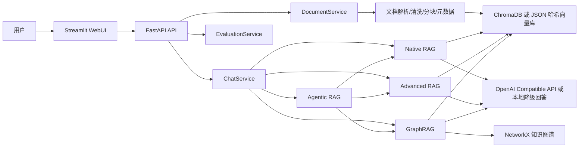
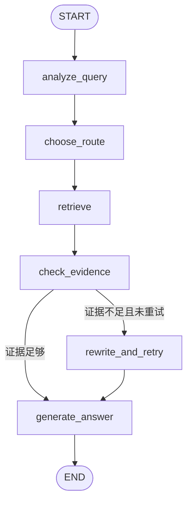

# TeamRAG：多源课程资料智能问答平台

TeamRAG 是一个五人协作课程项目，用 Streamlit 提供中文 WebUI，用 FastAPI 提供后端接口，支持上传 PDF、DOCX、TXT、Markdown 课程资料，完成解析、分块、索引、检索、RAG 问答、GraphRAG 和 Agentic RAG 演示。

项目优先保证本地可运行：没有 API Key、没有下载 embedding 模型或没有 ChromaDB 时，会自动使用本地哈希向量索引和降级回答；配置 OpenAI Compatible API 后可切换为真实大模型回答。

## 功能截图

截图可放在 `docs/images/`：

- 智能问答页
- 知识库管理页
- 知识图谱页
- 效果评估页

## 系统架构



## Native RAG 流程

```text
用户问题 -> 向量相似度检索 -> Top-K 文档片段 -> 拼接上下文 -> LLM/降级回答 -> 引用来源
```

## Advanced RAG 流程

Advanced RAG 已实现：

- Query Rewrite：对短问题或指代不清的问题补全检索意图。
- Hybrid Retrieval：向量检索和关键词检索加权融合。
- Lightweight Rerank：使用词项重合、原始相似度和章节元数据重排。
- Metadata Filter：按文件名、类型等元数据过滤。
- Context Compression：去重并截断过长上下文。

当前 rerank 是可替换的轻量策略，不依赖独立重排模型。

## GraphRAG 流程

```text
文档块 -> 正则实体/关系抽取 -> NetworkX 图谱 -> 保存 JSON -> 问题实体命中 -> 邻居/关系事实 -> 联合向量检索生成答案
```

实体抽取失败或图谱为空时，GraphRAG 会继续使用向量检索结果回答。

## Agentic RAG 流程



Agent 工具包括 `vector_search`、`hybrid_search`、`graph_search`、`document_filter`、`answer_generator`。路由规则会把关系类问题交给 GraphRAG，把复杂或模糊问题交给 Advanced RAG，其他问题交给 Native RAG。

## 目录结构

```text
app/api              FastAPI 入口与路由
app/core             配置、日志和异常
app/ingestion        文档加载、清洗、分块和元数据
app/retrieval        向量检索、混合检索、重排和问题改写
app/rag              Native/Advanced/Graph/Agentic RAG
app/graph            实体抽取、图谱构建、存储和检索
app/agents           LangGraph 工作流
app/services         服务层
app/ui               Streamlit 页面和组件
data                 上传文件、索引、图谱和样例资料
scripts              初始化、构建索引、构建图谱和一键启动
tests                pytest 测试
docs                 架构、API、Git 流程、演示和五人任务文档
```

## 环境配置

```bash
python -m venv .venv
```

Windows:

```bash
.venv\Scripts\activate
```

Linux/macOS:

```bash
source .venv/bin/activate
```

安装依赖：

```bash
pip install -r requirements.txt
```

复制配置：

```bash
cp .env.example .env
```

`.env` 至少支持：

```env
LLM_API_KEY=
LLM_BASE_URL=
LLM_MODEL=
EMBEDDING_MODEL=BAAI/bge-small-zh-v1.5
CHROMA_DIR=./data/chroma
UPLOAD_DIR=./data/uploads
```

兼容 OpenAI、DeepSeek、通义千问等 OpenAI Compatible API。`LLM_BASE_URL` 可填服务地址，例如 `https://api.openai.com/v1` 或其他兼容服务的 `/v1` 地址。

## 启动方式

初始化样例：

```bash
python scripts/init_project.py
python scripts/build_index.py
python scripts/build_graph.py
```

启动 FastAPI：

```bash
uvicorn app.api.main:app --reload --port 8000
```

启动 Streamlit：

```bash
streamlit run app/ui/streamlit_app.py
```

同时启动：

```bash
python scripts/run_all.py
```

Swagger 文档地址：`http://127.0.0.1:8000/docs`

## API 说明

- `GET /health`
- `POST /api/documents/upload`
- `GET /api/documents`
- `DELETE /api/documents/{document_id}`
- `POST /api/knowledge-base/index`
- `POST /api/knowledge-base/graph`
- `POST /api/chat`
- `POST /api/chat/stream`
- `POST /api/evaluate`

详细字段见 [docs/api.md](docs/api.md)。

## 五人分工

- 成员 1：WebUI，分支 `feature/ui-webui`
- 成员 2：文档处理与知识库，分支 `feature/document-ingestion`
- 成员 3：Native RAG 与 Advanced RAG，分支 `feature/native-advanced-rag`
- 成员 4：GraphRAG，分支 `feature/graphrag`
- 成员 5：Agentic RAG 与系统集成，分支 `feature/agentic-integration`

项目已经完成实现，五名成员只需要领取 `handoff/` 中对应交接包并提交自己的分支。提交教程见 [docs/member-submission-guide.md](docs/member-submission-guide.md)。

## Git 分支说明

```bash
git checkout develop
git checkout -b feature/ui-webui
git push -u origin feature/ui-webui
```

所有 feature 分支向 `develop` 提 PR，测试通过后由组长把 `develop` 合并到 `main`。禁止直接 force push `main`。详见 [docs/git-workflow.md](docs/git-workflow.md)。

## 测试说明

```bash
pytest -q
ruff check .
```

测试不依赖 API Key；未配置 API Key 时使用本地降级回答。

## 演示步骤

课堂演示流程见 [docs/demo-script.md](docs/demo-script.md)，推荐先运行：

```bash
python scripts/init_project.py
python scripts/build_index.py
python scripts/build_graph.py
python scripts/run_all.py
```

## 已知限制

- 本地降级回答只是根据检索片段组织答案，不等同真实大模型推理。
- 未安装 ChromaDB 或 sentence-transformers 时，会使用 JSON 哈希向量库，适合演示和测试，但语义检索能力弱于真实 embedding。
- 实体关系抽取使用轻量正则策略，可运行但精度有限。
- `POST /api/chat/stream` 当前按字符流式返回最终文本，不是 token 级模型流。

## 后续改进方向

- 接入专用 rerank 模型。
- 改进中文实体关系抽取，加入 LLM 辅助抽取。
- 增加用户级知识库隔离和权限控制。
- 增加评估指标，如 Recall@K、MRR、引用准确率。
- 增加 GitHub Pages 或 Docker 镜像发布流程。
