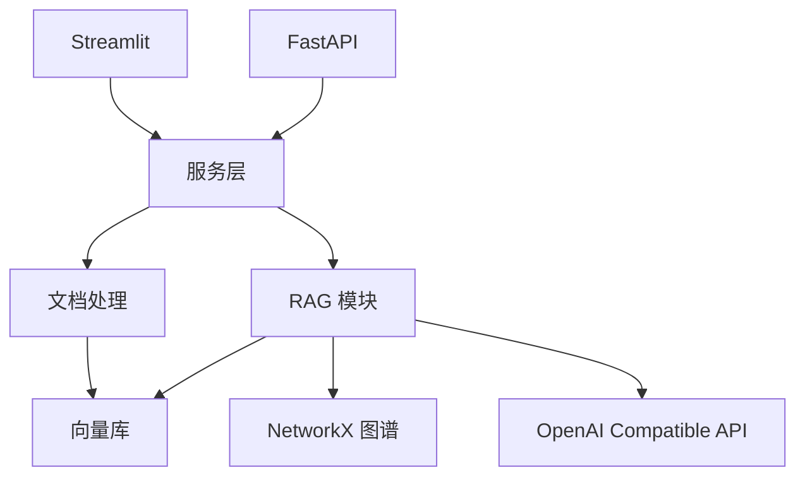

# 系统架构

TeamRAG 采用模块化分层：

- WebUI：`app/ui`，负责中文交互页面。
- API：`app/api`，负责 Swagger、上传、索引、问答、评估。
- Service：`app/services`，编排文档、问答和评估流程。
- Ingestion：`app/ingestion`，负责文档解析、清洗、分块和元数据。
- Retrieval：`app/retrieval`，负责向量检索、混合检索、改写和重排。
- RAG：`app/rag`，统一 Native、Advanced、Graph、Agentic 输出结构。
- Graph：`app/graph`，负责 NetworkX 图谱。
- Agents：`app/agents`，负责 LangGraph 工作流。

## 降级策略

- ChromaDB 不可用：自动使用 `data/chroma/index.json`。
- sentence-transformers 不可用：自动使用哈希向量。
- API Key 不可用：自动使用本地检索摘要回答。
- 图谱为空：GraphRAG 回退到向量检索结果。

